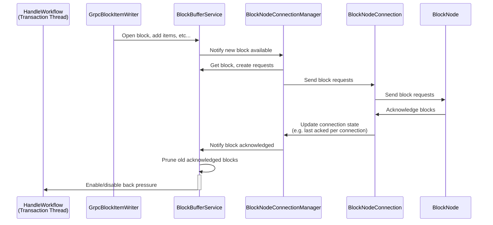

# BlockBufferService.md

## Table of Contents

1. [Abstract](#abstract)
2. [Component Responsibilities](#component-responsibilities)
3. [State Management and Flow](#state-management-and-flow)
4. [Component Interaction](#component-interaction)
5. [Sequence Diagrams](#sequence-diagrams)
6. [Error Handling](#error-handling)

## Abstract

The `BlockBufferService` is responsible for maintaining the most recent blocks, along with their items and requests,
produced by a given consensus node in an ordered manner.

## Component Responsibilities

- Keeps a recent history of blocks produced by the consensus node.
- Tracks which blocks are currently being produced and what the latest (or highest) block acknowledged by the block node.
- Provides an interface for access any block that is held in the buffer.
- Regularly prunes the buffer to reclaim memory after a block has been acknowledged and exceeded the max TTL.
- Monitors the buffer for saturation (i.e. too many blocks unacknowledged) and applies back pressure if necessary.

## State Management and Flow

- Updates stream progress on receipt of new blocks or acknowledgments.
- Implements backpressure and flow control logic to handle varying network conditions.
- Maintains an internal buffer of blocks with timestamps for acknowledgment tracking.
- Periodically prunes acknowledged blocks exceeding the TTL to maintain buffer size and resource efficiency.
- Calculates buffer saturation as a percentage of ideal max buffer size derived from TTL and block period.
- Activates or deactivates backpressure based on saturation status, coordinating with blocking futures to manage flow control.

## Component Interaction

- New blocks and their items are received from `GrpcBlockItemWriter`.
- Bi-directional communication with `BlockNodeConnectionManager` to notify new blocks available and receive updates on
  when new blocks are acknowledged by the block node(s).
- Applies back pressure via `HandleWorkflow`.

## Backpressure Mechanism

The block stream system implements a backpressure mechanism to ensure that block nodes keep pace with the incoming block stream.
If block acknowledgments are delayed beyond a configurable threshold, this mechanism activates to halt further block production and transaction handling on the consensus node.
This ensures system stability and prevents the accumulation of unacknowledged blocks in the stream buffer.

### Buffer Management

The system maintains a buffer of block states in `BlockBufferService` with the following characteristics:

- Each block state contains the block items and requests for a specific block number.
- The buffer tracks acknowledgment status as a single high watermark.
- Entries remain in the buffer until acknowledged and expired, according to a configurable TTL (Time To Live).
- A periodic pruning mechanism removes acknowledged and expired entries.
- The buffer size is monitored to implement backpressure when needed.

### Buffer State

The buffer can be in one of three states at any given time:
- Zero/Low Saturation: There are no blocks unacked or there are some but not enough to warrant any actions.
- Action Stage Saturation: Once the buffer reaches a level of saturation called the 'action stage', proactive actions
are taken to attempt buffery recovery. Currently, this means forcing a connection to a different block node.
- Full Saturation: The buffer is full of unacked blocks and no more blocks can be opened until recovery happens (i.e.
blocks are acknowledged.)

Over the course of the buffer's lifecycle there are several state transitions that can occur, each with its own set of
actions to take.
- Zero/Low Saturation to Full Saturation
- Back pressure is enabled
- Switch block nodes1
- Zero/Low Saturation to Action Stage Saturation
- Switch block nodes1
- Zero/Low Saturation to Zero/Low Saturation
- No action required
- Action Stage Saturation to Full Saturation
- Back pressure is enabled
- Switch block nodes1
- Action Stage Saturation to Action Stage Saturation
- Switch block nodes1
- Action Stage Saturation to Zero/Low Saturation
- No action required
- Full Saturation to Full Saturation
- Back pressure is enabled (though it should already be)
- Switch block nodes1
- Full Saturation to Action Stage Saturation
- Disable back pressure2
- Switch block nodes1
- Full Saturation to Zero/Low Saturation
- Disable back pressure2

Additionally, upon each iteration a secondary check will be performed to determine if back pressure needs to be disabled
if the buffer saturation falls below the recovery threshold. This check is performed regardless of the above operations.

1 Switching block node connections may not happen every time. Whether or not to switch block nodes is dictated
by a grace period between switch attempts. This is configured by `blockStream.buffer.actionGracePeriod`. If this property
is configured to 10 seconds, then switching nodes will only happen once every 10 seconds.

2 Disabling back pressure has an additional gate in form of a recovery threshold. This is configured by
`blockStream.buffer.recoveryThreshold`. If this property is configured to 70.0, then the buffer saturated must be less
than or equal to 70% before back pressure is disabled.

### Backpressure Implementation

The backpressure mechanism operates at two levels:

1. **Block State Buffer Level**
   - An asynchronous thread is continuously running in the background to prune the buffer.
   - Pruning occurs on a configurable interval defined in `blockStream.buffer.pruneInterval` (if set to `0`, the pruning is disabled)
   - Acknowledged states older than `blockStream.buffer.blockTtl` are removed
   - If buffer size exceeds safe thresholds after pruning, backpressure is applied
2. **HandleWorkflow Level**
   - `HandleWorkflow` checks for backpressure signals before processing each round of transactions
   - When backpressure is active, block production and transaction handling are paused
   - Processing resumes only after back pressure is removed (i.e. once blocks in the buffer are being acknowledged in
     a timely manner)

### Backpressure Flow

1. **Monitoring Phase**
   - `BlockBufferService` tracks buffer size and block age
   - Periodic pruning task runs based on `blockStream.buffer.pruneInterval`
   - Buffer metrics are updated for monitoring purposes
2. **Triggering Phase**
   - Backpressure triggers when:
     - Acknowledgments do not arrive within the configured TTL
     - Buffer size grows beyond safe threshold due to unacknowledged or delayed block responses
     - Pruning cannot reduce buffer size sufficiently
     - Block nodes fall significantly behind in processing
3. **Application Phase**
   - `HandleWorkflow` receives backpressure signal
   - Block production and transaction processing pauses
   - Streaming continues for already generated blocks to allow block nodes to catch up
   - Buffer gradually reduces as blocks are acknowledged
4. **Recovery Phase**
   - Buffer saturation recovers as more blocks are acknowledged
   - Once buffer reaches safe levels, backpressure releases
     - The 'recovery threshold' is configured by the property `blockStream.buffer.recoveryThreshold`. This value represents
       the saturation level at which the buffer is considered sufficiently free to accept more blocks. For example, if
       this value is 60%, then the buffer must be at or below 60% saturation before back pressure is removed.
   - Transaction processing resumes

### Block Buffer Persistence

Since the block buffer is a memory-based data structure, when an application restart happens the buffer gets reset to an
empty state. For most use cases this is OK, but if a block node requests a recent block the consensus node may not be
able to provide it. Because of this, there are two "recovery" mechanisms in place: 1) pre-consensus event stream (PCES)
replay and 2) block buffer persistence.

At any given time the platform keeps a set of events since the last saved state called the pre-consensus event stream or
PCES. The PCES data gets reset upon each state save operation, which typically occurs every 15 minutes. If the
application crashes, upon startup the PCES files will be automatically read and subsequent blocks will be re-built.
However, given that a block in the buffer has a lifespan of 5 minutes (configurable), if the application crashes within
five minutes of the last state save, then the PCES files will not contain information to build blocks from before the
state save. This would mean that upon restart only a partial set of the blocks that would have been in the buffer will
be re-created.

To address this issue, a secondary mechanism is in place: persisting the buffer itself. Upon being notified a state save
has occurred, all the blocks in the buffer will be written to disk, regardless of if some may be covered by PCES replay.
Upon startup of the block buffer service, an attempt will be made to load the most recent blocks from disk.

## Sequence Diagrams

