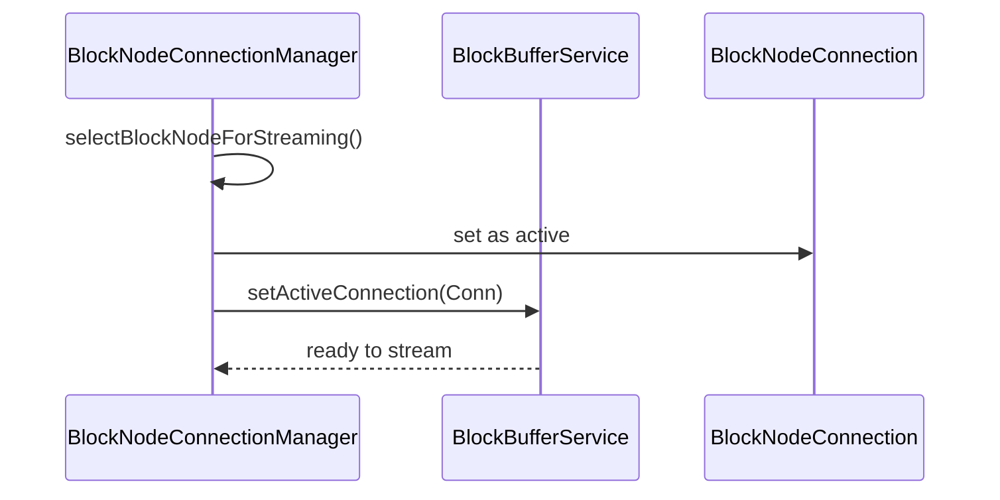
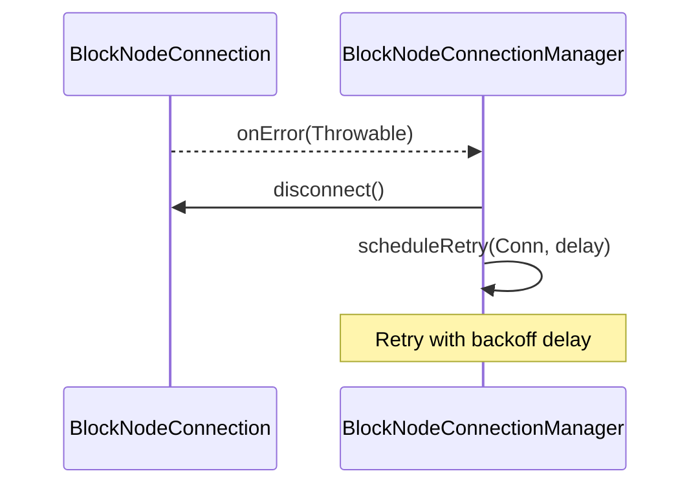
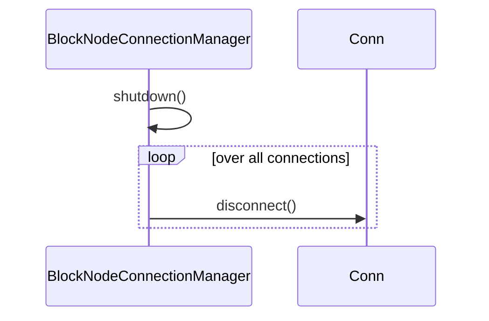

# Internal Design Document for BlockNodeConnectionManager

## Table of Contents

1. [Abstract](#abstract)
2. [Definitions](#definitions)
3. [Component Responsibilities](#component-responsibilities)
4. [Component Interaction](#component-interaction)
5. [Sequence Diagrams](#sequence-diagrams)
6. [Error Handling](#error-handling)

## Abstract

This document describes the internal design and responsibilities of the `BlockNodeConnectionManager` class.
This component manages active connections, handling connection lifecycle, and coordinating
with individual connection instances. There should be only one active connection at a time.
The class also interacts with the `BlockBufferService` to synchronize stream state.

## Definitions

<dl>
<dt>BlockNodeConnectionManager</dt>
<dd>The class responsible for managing and tracking all active block node connections, including creation, teardown, and error recovery.</dd>

<dt>BlockNodeConnection</dt>
<dd>A representation of a single connection to block node, managed by the connection manager.</dd>

<dt>BlockBufferService</dt>
<dd>The component responsible for maintaining the state of block streams received or sent over connections.</dd>

<dt>Connection Lifecycle</dt>
<dd>The phases a connection undergoes.</dd>
</dl>

## Component Responsibilities

- Maintain a registry of active connection instances.
- Track the latest verified block for each connection.
- Select the most appropriate connection for streaming blocks.
- Retry failed connections with exponential backoff.
- Remove or replace failed connections.
- Support lifecycle control.

## Component Interaction

- Maintains a bidirectional association with each connection.
- Delegates block-related streaming control to the `BlockBufferService`.
- Updates connection state and retry schedule based on feedback from connections.

## Sequence Diagrams

### Connection Establishment

### Connection Error and Retry

### Shutdown Lifecycle

## Error Handling

- Implements backoff-based retry scheduling when connections fail.
- Detects and cleans up errored or stalled connections.
- If `getLastVerifiedBlock()` or other state is unavailable, logs warnings and may skip the connection.
- Ensures that only one active connection is driving the stream via coordination with `BlockBufferService`.
