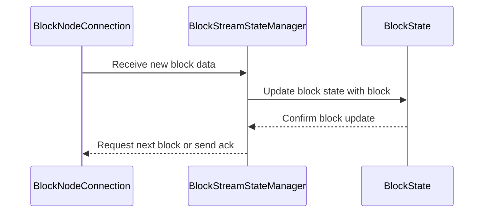
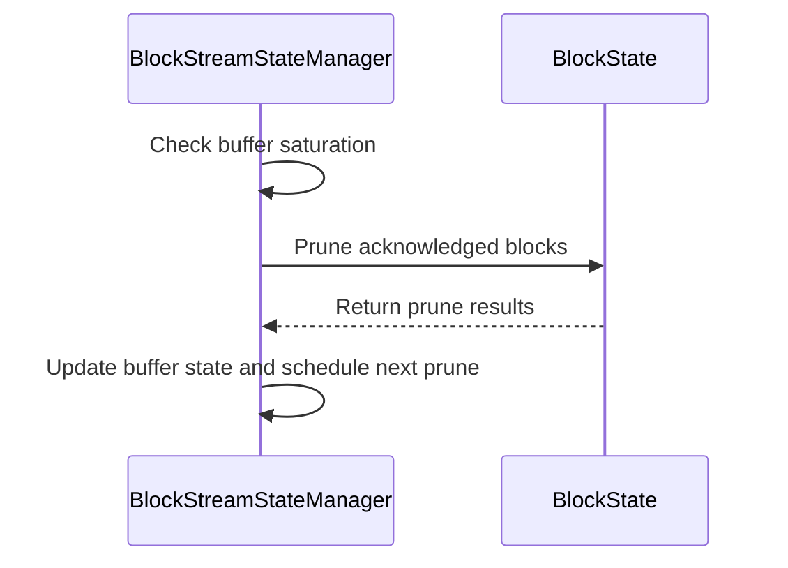
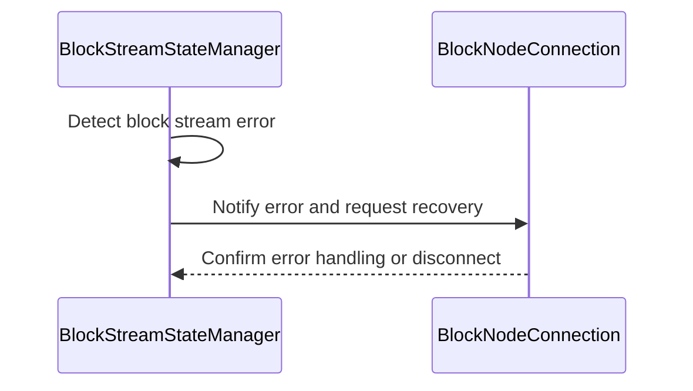

# BlockStreamStateManager.md

## Table of Contents

1. [Abstract](#abstract)
2. [Definitions](#definitions)
3. [Component Responsibilities](#component-responsibilities)
4. [State Management and Flow](#state-management-and-flow)
5. [Component Interaction](#component-interaction)
6. [Sequence Diagrams](#sequence-diagrams)
7. [Error Handling](#error-handling)

## Abstract

`BlockStreamStateManager` manages the state and progress of block streaming operations
within the Block Node system. It coordinates streaming sessions,
and ensures consistent delivery and recovery during block synchronization.

## Definitions

<dl>
<dt>BlockStreamStateManager</dt>
<dd>Component responsible for maintaining the streaming state and coordinating streaming flows.</dd>

<dt>Streaming Session</dt>
<dd>An active stream of block data being transferred between Consensus Node and a Block Node.</dd>
</dl>

## Component Responsibilities

- Track progress of block streams, including current block number.
- Manage streaming session lifecycle.
- Coordinate retries and recovery on streaming errors.
- Provide interfaces to query streaming status and progress.
- Work with `BlockNodeConnection` and `BlockState` to ensure consistent state across streams.
- Manage the pruning of blocks from the buffer that have been acknowledged and have exceeded the configured TTL.
- Monitor buffer saturation and activate backpressure mechanisms to regulate incoming block streams.

## State Management and Flow

- Maintains a mapping of active streams to their current block offset.
- Updates stream progress on receipt of new blocks or acknowledgments.
- Triggers events when streams complete, stall, or encounter errors.
- Implements backpressure and flow control logic to handle varying network conditions.
- Maintains an internal buffer of blocks with timestamps for acknowledgment tracking.
- Periodically prunes acknowledged blocks exceeding the TTL to maintain buffer size and resource efficiency.
- Calculates buffer saturation as a percentage of ideal max buffer size derived from TTL and block period.
- Activates or deactivates backpressure based on saturation status, coordinating with blocking futures to manage flow control.

## Component Interaction

- Receives block state updates from `BlockState`.
- Communicates streaming control commands to `BlockNodeConnection`.
- Reports stream progress and errors to `BlockNodeConnectionManager`.

## Backpressure Mechanism

The block stream system implements a backpressure mechanism to ensure that block nodes keep pace with the incoming block stream.
If block acknowledgments are delayed beyond a configurable threshold, this mechanism activates to halt further block production and transaction handling on the consensus node.
This ensures system stability and prevents the accumulation of unacknowledged blocks in the stream buffer.

### Buffer Management

The system maintains a buffer of block states in `BlockStreamStateManager` with the following characteristics:

- Each block state contains the block items and requests for a specific block number
- The buffer tracks acknowledgment status for each block
- Entries remain in the buffer until acknowledged or expired, according to a configurable TTL (Time To Live)
- A periodic pruning mechanism removes acknowledged and expired entries
- The buffer size is monitored to implement backpressure when needed

### Backpressure Implementation

The backpressure mechanism operates at two levels:

1. **Block State Buffer Level**
   - When a block state is added to the buffer, the system checks if pruning is needed
   - Pruning occurs on a configurable interval defined in `BlockStreamConfig.blockBufferPruneInterval` (if set to `0`, the pruning is disabled)
   - Acknowledged states older than `BlockStreamConfig.blockBufferTtl`are removed
   - If buffer size exceeds safe thresholds after pruning, backpressure is applied
2. **HandleWorkflow Level**
   - `HandleWorkflow` checks for backpressure signals before processing each round of transactions
   - When backpressure is active, block production and transaction handling are paused
   - Processing resumes only after acknowledgment flow recovers and buffer saturation is reduced

### Backpressure Flow

1. **Monitoring Phase**
   - `BlockStreamStateManager` tracks buffer size and state age
   - Periodic pruning task runs based on `BlockStreamConfig.blockBufferPruneInterval`
   - Buffer metrics are updated for monitoring purposes
2. **Triggering Phase**
   - Backpressure triggers when:
     - Acknowledgments do not arrive within the configured TTL
     - Buffer size grows beyond safe threshold due to unacknowledged or delayed block responses
     - Pruning cannot reduce buffer size sufficiently
     - Block nodes fall significantly behind in processing
3. **Application Phase**
   - `HandleWorkflow` receives backpressure signal
   - Block production and transaction processing pauses
   - Streaming continues for already generated blocks to allow block nodes to catch up
   - Buffer gradually reduces as blocks are acknowledged
4. **Recovery Phase**
   - Buffer size reduces through:
     - Incoming block acknowledgments from block nodes
     - Pruning of expired states
     - Natural processing of buffered blocks
   - Once buffer reaches safe levels, backpressure releases
   - Transaction processing resumes

## Sequence Diagrams

### Connection Initialization

### Prune Buffer

## Error Handling

- Detects and reports stream stalls, gaps, or inconsistencies.
- Supports automatic retries with exponential backoff.
- Handles cleanup and reset of streaming sessions on unrecoverable errors.

