# Otter Framework Architecture

This document provides a comprehensive overview of the Otter Test Framework's architecture, including core abstractions and environment implementations.

## 🎯 Design Principles

1. **Environment Abstraction** - Common interfaces for multiple environments
2. **Dependency Injection** - JUnit extension provides configured components
3. **Builder Pattern** - Fluent APIs for test configuration
4. **Resource Management** - Automatic cleanup of resources after tests
5. **Observer Pattern** - Results collected through subscription mechanisms

## 🏁 Entry Point

The following diagram illustrates the entry point to the Otter Test Framework API:

A test method that wants to use the Otter Test Framework has to be annotated with `@OtterTest`. The annotation triggers the `OtterTestExtension` which handles test lifecycle and parameter resolution. The extension creates a
`TestEnvironment` that provides access to core testing components including a `Network`, `TimeManager`, and `TransactionGenerator`.

## 🏗️ Network and Node Management

The Network-Node relationship forms the core testing abstraction:

The `Network` interface manages collections of nodes and provides operations like starting, stopping, and freezing the network, while the `Node` interface defines the contract for individual consensus nodes with capabilities like transaction submission and status monitoring. The framework supports multiple concrete implementations, all inheriting from the `AbstractNode` base class that provides common functionality.

### Node Lifecycle

All nodes follow a consistent lifecycle:

```mermaid
stateDiagram-v2
    [*] --> INIT
    INIT --> RUNNING : start()
    RUNNING --> SHUTDOWN : killImmediately()
    SHUTDOWN --> RUNNING : start()
    SHUTDOWN --> DESTROYED : destroy()
    DESTROYED --> [*]

    note right of RUNNING : ✅ Can submit transactions\n📊 Collects data for assertions
    note right of SHUTDOWN : 🔄 Can be restarted\n💾 Data preserved
    note right of DESTROYED : ❌ Cannot be restarted\n🧹 Resources cleaned up
```

## 🌍 Environment Selection

The framework uses the Strategy pattern to provide different test environments while maintaining a consistent API.  Environment selection happens at runtime via system properties:

```mermaid
flowchart TD
    A[Test Execution] --> B{System Property}
    B -->|otter.env=turtle or default| C[TurtleTestEnvironment]
    B -->|otter.env=container| D[ContainerTestEnvironment]

    C --> E[🐢 Simulated Network]
    D --> F[🐳 Docker Containers]

    E --> G[⚡ Simulated Time]
    F --> H[⏰ Real Time]

    style C fill:#f3e5f5
    style D fill:#e3f2fd
```

### Key Features

Both environments provide a consistent API while optimizing for different testing needs:

#### Turtle Environment

- ⚡ **Fast Execution** - 30-second simulations in ~2 seconds
- 🎲 **Deterministic** - Reproducible with fixed seeds
- 🧮 **Simulated Time** - Precise time control
- 🌐 **Network Simulation** - Configurable delays and failures
- 🔄 **Fast feedback** - Perfect for development

#### Key Features

- 🐳 **Real Containers** - Actual Docker containers
- 📡 **gRPC Communication** - Real network protocols
- ⏰ **Real Time** - Actual time progression
- 🔒 **Isolation** - True process isolation
- 🧪 **Realistic Testing** - Closer to production

### Architecture Overview

The following class diagram illustrates the relationships between the core interfaces and their implementations in different environments:

Each environment implements the `TestEnvironment` interface, providing access to a `Network` and its associated `Node` instances. More details on each environment's architecture are provided in their dedicated documents:

* [🐢 Turtle Environment](turtle-environment.md)
* [🐳 Container Environment](container-environment.md)

## 📊 Results and Assertions

The framework provides comprehensive result collection and assertion capabilities. The following diagram illustrates the result collection architecture for consensus results. Other result types follow a similar pattern.

A `SingleNodeConsensusResult` collects results for a single node, while `MultipleNodeConsensusResults` aggregates results from multiple nodes, typically for the whole network, but it can easily be limited to a subset. The `NodeResultsCollector` is responsible for collecting and managing the results for each node.

## 🔗 Related Documentation

|          Topic          |                                   Link                                   |
|-------------------------|--------------------------------------------------------------------------|
| **Getting Started**     | [Quickstart Guide](getting-started.md)                                   |
| **Environment Details** | [Turtle](turtle-environment.md) \| [Container](container-environment.md) |
| **Test Development**    | [Writing Tests Guide](writing-tests.md)                                  |
| **API Reference**       | [Assertions API](assertions-api.md)                                      |
| **Configuration**       | [Configuration Guide](configuration.md)                                  |

The architecture's modular design enables easy extension while maintaining consistency across different test environments and scenarios.
