# 🐳 Container Environment Guide

Comprehensive guide to Docker-based testing with the Container environment for realistic consensus validation.

## Table of Contents

- [🎯 Overview](#-overview)
- [🏗️ Network and Node Management](#-network-and-node-management)
- [🐳 Docker Integration](#-docker-integration)
  - [Image Building](#image-building)
  - [Container Startup Process](#container-startup-process)
  - [gRPC Protocol](#grpc-protocol)
  - [Event Streaming Flow](#event-streaming-flow)
  - [Debugging Container Tests](#debugging-container-tests)

## 🎯 Overview

The Container environment provides **realistic testing conditions** using actual Docker containers running consensus
nodes. This environment is ideal for:

- **Integration Testing**: Validate real network communication and Docker deployment
- **Production Validation**: Test scenarios closer to production deployment

### Container Environment Components

The following diagram illustrates the Container environment's core architecture:


The `ContainerTestEnvironment` is the main container that owns a single `ContainerNetwork`, `RegularTimeManager`, and
`ContainerTransactionGenerator`. The `ContainerNetwork` can contain zero or more `ContainerNode` instances.
`ContainerTestEnvironment` manages all the core components needed to run production-like tests with multiple nodes in a
Docker container network.

## 🏗️ Network and Node Management

The following diagram shows the key interfaces and classes for managing networks and nodes in the Container environment:


The `Network` interface and its abstract implementation `AbstractNetwork` provide the foundation for managing
collections of consensus nodes, with `ContainerNetwork` being a specific implementation that uses Testcontainers to run
nodes in Docker containers. The `Node` interface and its `AbstractNode` base class represent individual consensus
participants, with `ContainerNode` being the concrete implementation that integrates with the containerized network
environment.

## 🐳 Docker Integration

### Image Building

The framework automatically builds Docker images from the DockerApp implemented in the module
`consensus-otter-docker-app`. The Dockerfile is generated based on the contents of the `apps` and `lib` directories in
the module. The image is built using the Eclipse Temurin base image for Java 21:

```dockerfile
FROM eclipse-temurin:21

# Create non-root user and group
RUN groupadd -r appuser && useradd -r -g appuser appuser

# Create app directories and set ownership
RUN mkdir -p /opt/DockerApp/apps /opt/DockerApp/lib \
    && chown -R appuser:appuser /opt/DockerApp

# Copy app artifacts with proper ownership
COPY --chown=appuser:appuser apps/* /opt/DockerApp/apps/
COPY --chown=appuser:appuser lib/* /opt/DockerApp/lib/

# Run as non-root user
USER appuser

CMD ["java", "-jar", "/opt/DockerApp/apps/DockerApp.jar"]
```

### Container Startup Process

There are two processes, each with their own API, that the `ContainerNode` interacts with:

1. **DockerApp**: The application running inside the Docker container that starts and stops the second process via a
   gRPC API. It is initialized when the node is created in the test and runs until the container is killed at test
   teardown.
2. **NodeCommunicationService**: The application running inside the Docker container that provides a second gRPC API for
   communicating with the consensus node. It is initialized when the consensus node is started and is killed when the
   consensus node is killed.

These two applications are run in separate processes within the same Docker container so that the consensus node process
can be killed and restarted without having to restart the entire container. This setup allows for more flexible testing
scenarios, such as simulating node failures or restarts.

When a `ContainerNode` is created, it starts a Docker container running the `DockerApp` using the default `DockerMain`
class. The container is configured to expose port 8080 for gRPC communication. The `DockerApp` initializes a gRPC server
and listens for incoming connections from the `ContainerNode`. When the `ContainerNode` is started, a command is sent to
the `DockerApp` to initialize a second process inside the container that exposes the second gRPC API. This second API is
for communicating with the consensus node and can do things like start the node, submit transactions, and perform a
freeze.

The following sequence diagram shows the container startup process:

```mermaid
sequenceDiagram
    participant Test as Test
    participant ContainerNetwork
    participant ContainerNode
    participant GenericContainer
    participant Container as Docker Container
    participant DockerMain
    participant DockerManager
    participant ConsensusNodeMain
    participant NodeCommunicationService
    participant ConsensusNodeManager
    participant Platform
    Test ->> ContainerNetwork: addNodes(4)

    loop For each node
        ContainerNetwork ->>+ ContainerNode: new ContainerNode()
        ContainerNode ->>+ GenericContainer: new GenericContainer()
        GenericContainer ->>+ Container: Start container
        ContainerNode ->> Container: start()
        Container ->>+ DockerMain: java -jar DockerApp.jar
        DockerMain ->>+ DockerManager: Initialize gRPC server
        ContainerNode ->> DockerManager: Establish gRPC connection
    end

    Test ->> ContainerNetwork: start()

    loop For each node
        ContainerNetwork ->> ContainerNode: start()
        ContainerNode ->> DockerManager: Send InitRequest
        DockerManager ->>+ ConsensusNodeMain: java -cp DockerApp.jar
        ConsensusNodeMain ->>+ NodeCommunicationService: Initialize gRPC server
        ContainerNode ->> NodeCommunicationService: Establish gRPC connection
        ContainerNode ->> NodeCommunicationService: Send StartRequest
        NodeCommunicationService ->>+ ConsensusNodeManager: new ConsensusNodeManager()
        ConsensusNodeManager ->>+ Platform: Initialize
        ContainerNode ->> NodeCommunicationService: Send StartRequest
        NodeCommunicationService ->> ConsensusNodeManager: start
        ConsensusNodeManager ->> Platform: start
        Note over ContainerNode, Platform: 🔄 Ongoing consensus and event streaming
    end

    deactivate ContainerNode
    deactivate GenericContainer
    deactivate ConsensusNodeMain
    deactivate Container
    deactivate DockerMain
    deactivate DockerManager
    deactivate ConsensusNodeManager
    deactivate NodeCommunicationService
    deactivate Platform
```



## 📡 gRPC Protocol

Container nodes use two gRPC APIs for interacting with the container. One for creating and stopping the consensus node,
and one for interacting with the consensus node itself:

```protobuf
// Service definition for controlling tests.
service ContainerControlService {
  // RPC to initialize the container with the node ID.
  rpc Init(InitRequest) returns (google.protobuf.Empty);

  // RCP to signal a kill of the app
  rpc KillImmediately(KillImmediatelyRequest) returns (google.protobuf.Empty);
}

// Request to initialize the container.
message InitRequest {...}

// Request to kill the application immediately.
message KillImmediatelyRequest {...}
```

```protobuf
// Service definition for communicating with the consensus node.
service NodeCommunicationService {

  // RPC to start the platform and stream event messages.
  rpc Start(StartRequest) returns (stream EventMessage);

  // RPC used by the test harness to submit a transaction to the running
  // platform. Returns an TransactionRequestAnswer weather the platform accepted the transaction or not.
  rpc SubmitTransaction(TransactionRequest) returns (TransactionRequestAnswer);

  // RPC to change the synthetic bottleneck of the handle thread.
  rpc SyntheticBottleneckUpdate(SyntheticBottleneckRequest) returns (google.protobuf.Empty);
}

// Wrapper for different types of event messages.
message EventMessage {
  // Oneof field to represent different event types.
  oneof event {
    // Platform status change event.
    PlatformStatusChange platform_status_change = 1;
    // Log entry event.
    LogEntry log_entry = 2;
    // Consensus rounds event.
    ProtoConsensusRounds consensus_rounds = 3;
    // Marker file event.
    MarkerFileAdded marker_file_added = 4;
  }
}
// Request to start the remote platform.
message StartRequest {...}

// Wrapper for a transaction submission request.
message TransactionRequest {...}

// Response to a transaction submission request.
message TransactionRequestAnswer {...}

// Request to set the synthetic bottleneck.
message SyntheticBottleneckRequest {...}
```

## 📢 Notification Flow


Once the `Platform` is started, the `ContainerNode` can receive events. The `Platform` notifies the
`ConsensusNodeManager` of various events such as status changes, log entries, and consensus rounds. The
`ConsensusNodeManager` then relays these events to the `NodeCommunicationService`, which streams them back to the
`ContainerNode` as `EventMessage` objects.

## 📁 File System Structure

All application files, data, and logs are stored under `/opt/DockerApp`. The owner of all files is a user named
`appuser`, which is created during the Docker image build process. Using a defined user who owns all files ensures that
we do not run into permission issues when accessing files from other containers as is done when tests are run as GitHub
actions.

### Layout

```
/opt/DockerApp
├── lib/                 # All .jar dependencies
├── apps/
│   └── DockerApp.jar    # Main application executable
├── data/
│   ├── saved/           # Persisted state
│   ├── tmp/             # Temporary files
│   └── stats/           # CSV statistics
├── output/
│   ├── swirlds.log      # Main log file
│   └── swirlds-hashstream/
│       └── swirlds-hashstream.log  # Hashstream logs
├── hgcapp/              # Event stream data (currently unused)
└── settingsUsed.txt     # Runtime configuration summary
```

Note: All persistent data must remain inside `/opt/DockerApp`.

## ⏱️ Time Management

The continuous assertions have to be evaluated on the main thread of the test, because otherwise JUnit would not be
aware of thrown `AssertionErrors`.


This sequence shows how time advancement is used to evaluate continuous assertions. When the test calls `waitFor()` or a
related method on the `TimeManager`, it advances time in fixed granularity steps (default 10ms) until the specified
duration is reached. During each tick, every `Node` is given a chance to process incoming `EventMessages` which also
evaluates continuous assertions defined on these messages. These ticks happen on the main test thread, ensuring that any
`AssertionError` thrown during processing is caught by JUnit.

## Debugging Container Tests

### 1. Container Logs

Access container logs for debugging:

```bash
# Find container names
docker ps

# View logs from specific container
docker logs <container_name>

# Follow logs in real-time
docker logs -f <container_name>
```

### 2. Network Inspection

```bash
# List Docker networks
docker network ls

# Inspect test network
docker network inspect <network_name>
```

### 3. Resource Monitoring

```bash
# Monitor container resource usage
docker stats

# Inspect specific container
docker inspect <container_name>
```

## 🔗 Related Documentation

|                        Guide                         |        Description        |
|------------------------------------------------------|---------------------------|
| [🏁 Getting Started](getting-started.md)             | Setup and your first test |
| [🏛️ Architecture](architecture.md)                  | Framework design overview |
| [✍️ Writing Tests](writing-tests.md)                 | Test development guide    |
| [🐢 Turtle Environment](turtle-environment.md)       | Simulated testing guide   |
| [🐳 Container Environment](container-environment.md) | Docker-based testing      |
