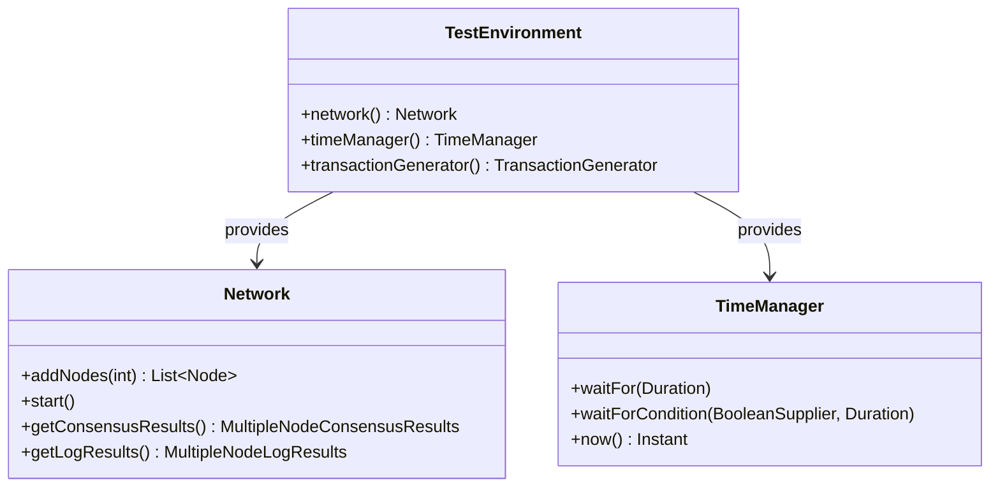

# Getting Started with Otter Test Framework

This guide walks you through writing your first consensus test using the Otter framework.

## 🧪 Your First Test

Create your first test:

```java
    @OtterTest
    void testConsensus(@NonNull final TestEnvironment env) throws InterruptedException {
        // 1. Get the network and time manager
        final Network network = env.network();
        final TimeManager timeManager = env.timeManager();

        // 2. Create a 4-node network
        network.addNodes(4);

        // 3. Start the network
        network.start();

        // 4. Wait 30 seconds while the network is running
        timeManager.waitFor(Duration.ofSeconds(30));

        // 5. Verify consensus was reached and advanced past round 2
        assertThat(network.getConsensusResults()).haveEqualCommonRounds().haveAdvancedSinceRound(2);

        // 6. Check for no error-level log messages
        assertThat(network.getLogResults()).haveNoErrorLevelMessages();
    }
```

### Key Components Explained

- **`@OtterTest`** - Marks test methods for Otter execution
- **`TestEnvironment`** - Provides access to network, time manager, and transaction generator
- **`Network`** - Manages consensus nodes and their lifecycle
- **`TimeManager`**: Controls time progression (simulated in Turtle, real in Container)

The test environment provides three main components. The diagram below illustrates how `TestEnvironment` serves as the main entry point, providing access to `Network` for network management and `TimeManager` for time control.



## 🎯 Test Environments

The framework supports two environments with identical APIs:

### 🐢 Turtle Environment (Default)

- **Deterministic** - Reproducible results
- **Simulated time** - Tests complete in seconds
- **Simulated gossip** - No real network communication
- **Fast feedback** - Perfect for development

### 🐳 Container Environment

- **Real Docker containers** - Production-like testing
- **Actual time** - Real network communication
- **Real gossip** - Tests run in a distributed environment
- **Realistic conditions** - Integration validation

### Environment Selection

```bash
# Run Turtle tests (fast, simulated)
./gradlew testTurtle

# Run specific Turtle test
./gradlew testTurtle --tests "org.hiero.otter.test.HappyPathTest"

# Run Container tests (production-like)
./gradlew testContainer
```

## Test Output

Tests generate detailed logs at environment-specific locations.

### Turtle Environment Logs

The logs can be found in the `build/turtle/` directory:

```
build/turtle/
├── otter.log                      # Global test log
├── node-0/
│   ├── swirlds.log                # Node-specific logs
│   └── swirlds-hashstream.log
└── node-1/
    ├── swirlds.log
    └── swirlds-hashstream.log
```

### Container Environment Logs

Container tests run in Docker, and logs are accessible via Docker commands:

```
docker logs <container-id>      # Container environment
```

## ⚠️ Common Issues

|        Issue         |                Solution                 |
|----------------------|-----------------------------------------|
| **Docker not found** | Ensure Docker is installed and running  |
| **Port conflicts**   | Kill processes using ports 8080+        |
| **Memory issues**    | Increase JVM heap: `-Xmx8g`             |
| **Timeout errors**   | Use longer timeouts for Container tests |

## Next Steps

Now that you've written your first test:

1. **Learn Framework Architecture** - [Architecture Guide](architecture.md)
2. **Explore Environments** - [Turtle Environment](turtle-environment.md) | [Container Environment](container-environment.md)
3. **Advanced Testing** - [Writing Tests Guide](writing-tests.md)
4. **Assertions API** - [Assertions Reference](assertions-api.md)
5. **Configuration** - [Configuration Guide](configuration.md)

## 💡 Tips for Success

- Start with Turtle environment for fast feedback
- Use Container environment for integration validation
- Begin with small networks (3-4 nodes)
- Check logs when tests fail
- Use fixed random seeds for reproducible issues
