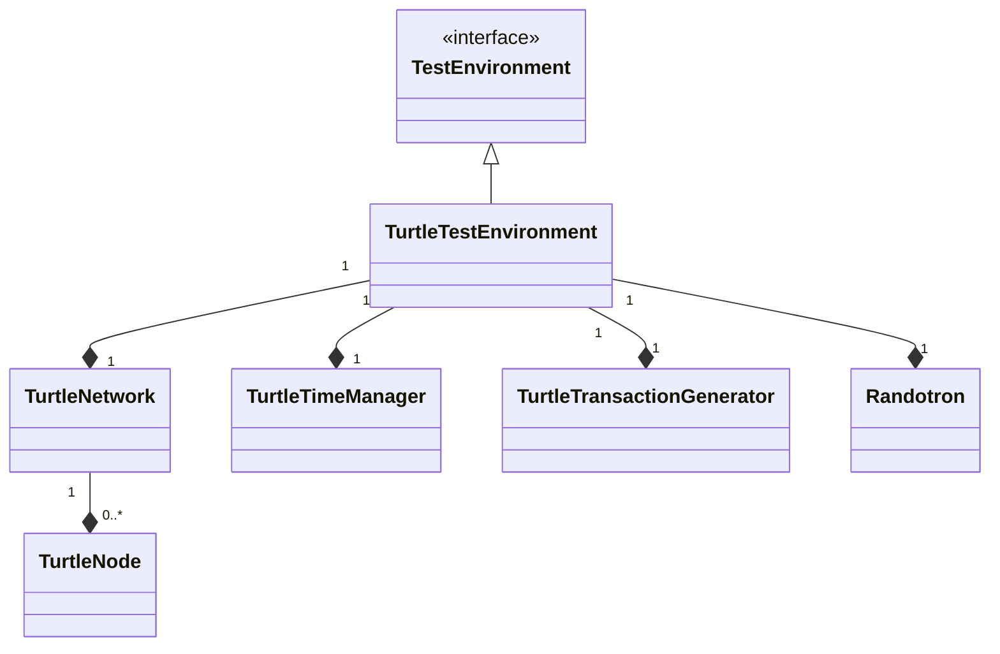
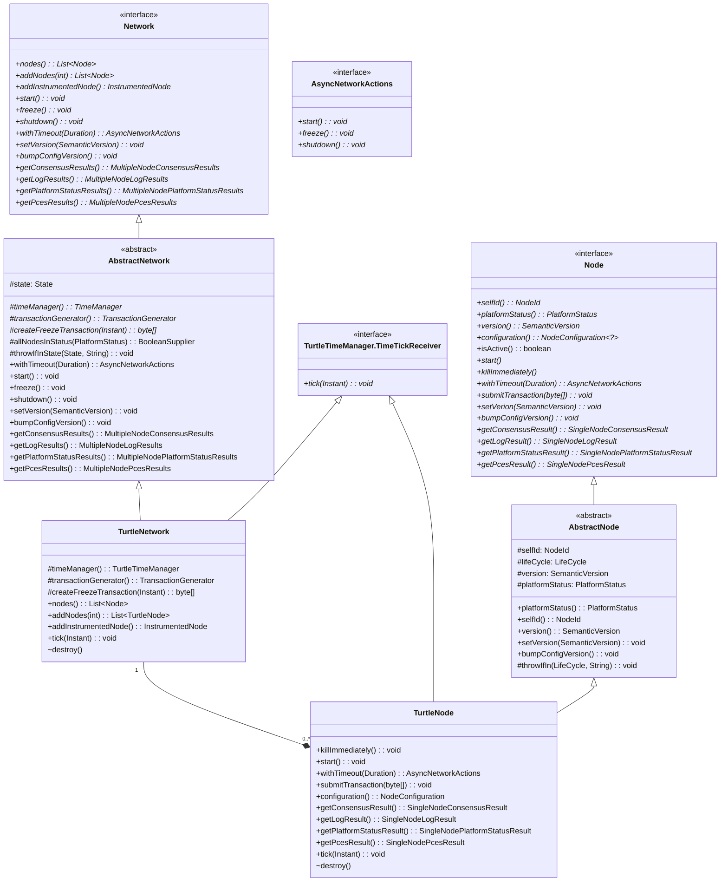
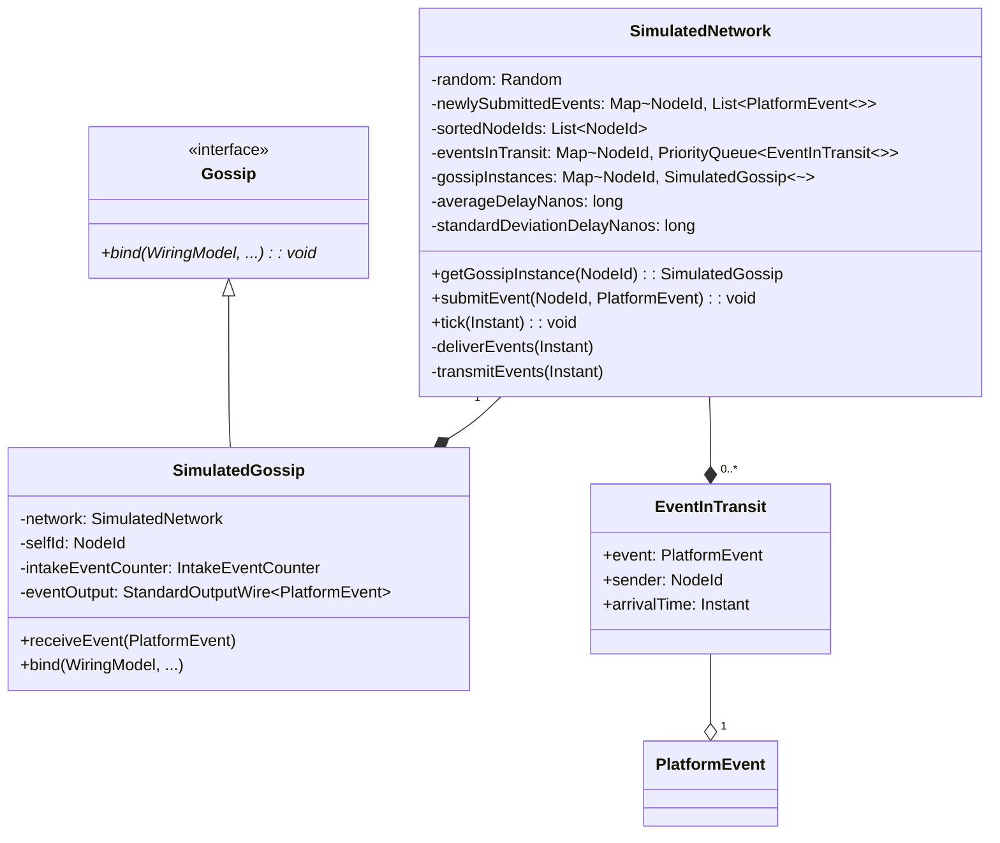
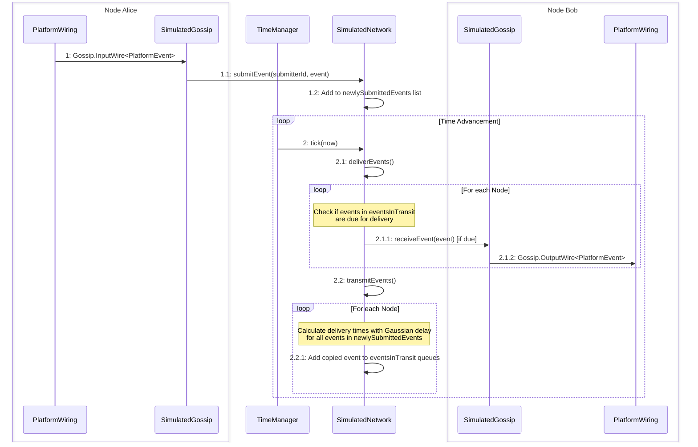
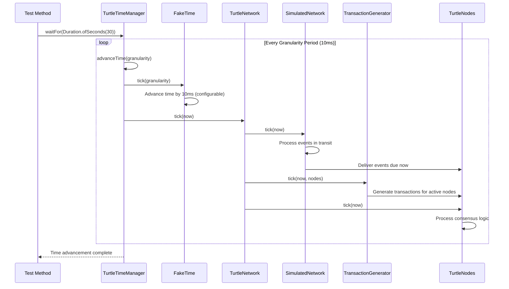

# 🐢 Turtle Environment Guide

Deep dive into the Turtle simulated testing environment for fast, deterministic consensus testing.

## Table of Contents

- [🎯 Overview](#-overview)
- [🏗️ Network and Node Management](#-network-and-node-management)
- [🌐 Network Simulation](#-network-simulation)
- [⏱️ Time Management](#-time-management)
- [🎲 Deterministic Testing](#-deterministic-testing)

## 🎯 Overview

The Turtle environment provides a **fast, simulated testing environment** that enables deterministic consensus testing without real network delays or Docker overhead. It's ideal for:

- **Development**: Fast iteration cycles during development
- **CI/CD**: Rapid test execution in build pipelines
- **Regression Testing**: Deterministic results for catching regressions
- **Algorithm Validation**: Testing consensus behavior under controlled conditions

### Turtle Environment Components

The following diagram illustrates the Turtle environment's core architecture:



The `TurtleTestEnvironment` is the main container that owns a single `TurtleNetwork`, `TurtleTimeManager`, `TurtleTransactionGenerator`, and `Randotron`. The `TurtleNetwork` can contain zero or more `TurtleNode` instances. `TurtleTestEnvironment` manages all the core components needed to run deterministic consensus tests with multiple nodes in a simulated, single-JVM environment.

## 🏗️ Network and Node Management

The following diagram shows the key interfaces and classes for managing networks and nodes in the Turtle environment:



The `Network` interface and its abstract implementation `AbstractNetwork` provide the foundation for managing collections of consensus nodes, with `TurtleNetwork` being a specific implementation that uses simulated time and fake network delays for testing. The `Node` interface and its `AbstractNode` base class represent individual consensus participants, with `TurtleNode` being the concrete implementation that integrates with the simulated network environment.

## 🌐 Network Simulation

### Simulated Network Delays

The `SimulatedNetwork` simulates realistic network conditions:



### Default Network Configuration

```java
// Default network parameters
static final Duration AVERAGE_NETWORK_DELAY = Duration.ofMillis(200);
static final Duration STANDARD_DEVIATION_NETWORK_DELAY = Duration.ofMillis(10);
```

### Event Transmission Flow

The following diagram shows how events flow through the simulated network:



The simulation of network communication happens in two steps:

#### Submitting an event

1\. When a node wants to submit an event, it is received by its `SimulatedGossip` instance via the appropriate `InputWire`.

1.1 `SimulatedGossip` calls `SimulatedNetwork.submitEvent(submitterId, event)`.

1.2 The `SimulatedNetwork` adds the event to the `newlySubmittedEvents` list, which is a map of submitter IDs to the lists of events.

#### Delivering and transmitting events

2\. When the simulated time is advanced, the `TurtleTimeManager` calls `SimulatedNetwork.tick(now)`.

2.1 The `SimulatedNetwork` calls `deliverEvents(now)` to process all events that are due for delivery.

2.1.1 For each node, it checks if any events in the `eventsInTransit` queue are due for delivery based on their arrival time. If so, it calls `receiveEvent(event)` on the corresponding `SimulatedGossip` instance.

2.1.2 The `SimulatedGossip` instance then forwards the event to its `OutputWire` from which it is consumed by the platform wiring.

2.2 After delivering events, the `SimulatedNetwork` calls `transmitEvents(now)` to process newly submitted events.

2.2.1 For each node, it calculates the delivery times for all events in the `newlySubmittedEvents` list using a Gaussian distribution. It then adds these events to the `eventsInTransit` queue for that node.

## ⏱️ Time Management

The Turtle environment's time management is central to its deterministic behavior:



This sequence shows how time advancement drives the entire simulation, ensuring deterministic execution. While code is running, time does not advance. When the test calls `waitFor()` or a related method on the `TurtleTimeManager`, it advances time in fixed granularity steps (default 10ms) until the specified duration is reached. During each tick, the `SimulatedNetwork` processes events, the `TransactionGenerator` creates transactions submitting them to active nodes, and the nodes execute their consensus logic.

## 🎲 Deterministic Testing

### Randotron Usage

The Turtle environment uses `Randotron` for all randomization:

```java
final Randotron randotron = randomSeed == 0L
    ? Randotron.create()
    : Randotron.create(randomSeed);
```

The same `Randotron` instance is used throughout the test, ensuring that all random operations are consistent and reproducible. This is crucial for deterministic testing, where the same inputs should yield the same outputs across runs.

> [!NOTE]
> When `randomSeed = 0`, a truly random seed is generated for each test run.

### Reproducible Tests with Random Seeds

Use `@TurtleSpecs` to control randomness and ensure reproducible test results:

```java
@OtterTest
@TurtleSpecs(randomSeed = 42)
void testDeterministicBehavior(@NonNull final TestEnvironment env) throws InterruptedException {
    // This test will produce identical results every time
    final Network network = env.network();
    network.addNodes(4);
    network.start();

    env.timeManager().waitFor(Duration.ofSeconds(30));

    // Results will be identical across runs
    final long lastRound =
            network.newConsensusResults().results().getFirst().lastRoundNum();

    // This assertion will always pass with seed=42
    assertThat(lastRound).isEqualTo(35);
}
```

## 🔗 Related Documentation

|                        Guide                         |        Description        |
|------------------------------------------------------|---------------------------|
| [🏁 Getting Started](getting-started.md)             | Setup and your first test |
| [🏛️ Architecture](architecture.md)                  | Framework design overview |
| [✍️ Writing Tests](writing-tests.md)                 | Test development guide    |
| [🐢 Turtle Environment](turtle-environment.md)       | Simulated testing guide   |
| [🐳 Container Environment](container-environment.md) | Docker-based testing      |
