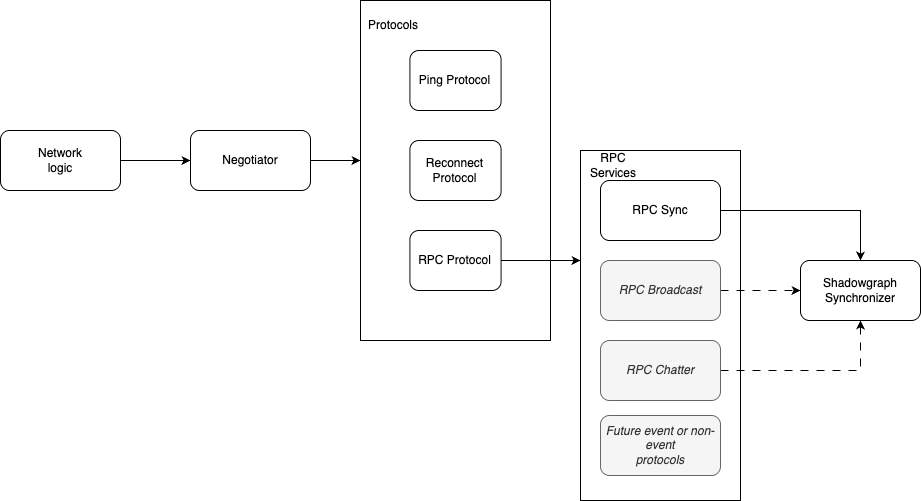
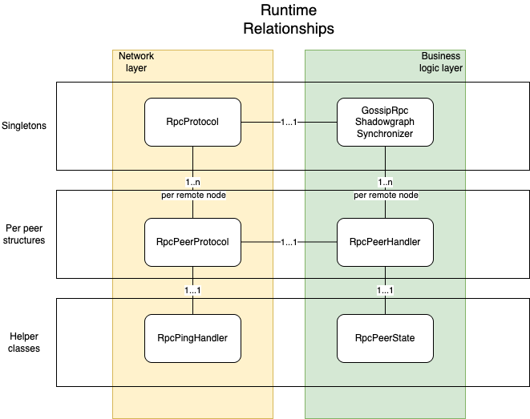
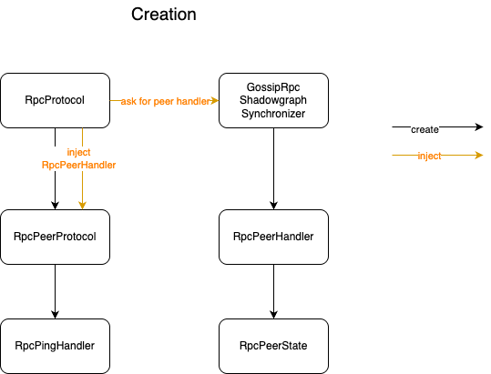

# Rewrite of old sync on top of message-based protocol

## Previous solution

The previous network communication strategy was based on dynamic negotiation of one of 3 protocols (Heartbeat/Ping, Sync, Reconnect). Each of them hogged the socket until it was finished with current task. It was implemented using ad-hoc byte sequences.


The negotiator selects one of the protocols and monopolizes the socket until it completes the protocol or is disconnected.

## Current Implementation

- Remains compatible with the reconnect protocol as much as possible
- Does not modify the existing connection creation/teardown process

The decision was to piggyback a message based protocol on top of the existing network. This means that instead of 3 protocols (Heartbeat/Ping, Sync, Reconnect) we have 3 different protocols (Heartbeat/Ping, Rpc and Reconnect). Rpc takes over the socket and handles everything (ping, sync, broadcast), releasing the connection only in case of falling behind, when reconnect will take over the responsibilities.

After the reconnect is done, RPC again grabs the connection forever.

Please note that we have two ping mechanisms here. Original one (protocol Heartbeat) is used when Reconnect is in control on one connection - it makes sure that other connections are not timing out due to no traffic. The other is hidden inside the RPC protocol and performs a similar role when the RPC protocol is in control of the connection (it is needed, as the RPC protocol doesn't periodically give the connection back to other protocols, like it was done in the older sync implementation)



The RPC protocol can interlace messages between various RPC services, without handing over the entire connection to a different protocol, which allows interlacing future messages like broadcast or chatter while Sync is running.

In this context, "Protocol" is legacy protocol logic, handled by negotiator, where there is a protocol negotiation at first, and then the connection is fully assigned to the given protocol. There are 3 Protocols currently, as mentioned above - Heartbeat/Ping, Reconnect, and RPC.

"RPC service" is a loose term to indicate a piece of self-contained logic that can run over the RPC protocol in parallel with each other (as opposed to old protocols, which were able to run only one at a time). Currently, we have logic for sync and ping in those services, but later we will add broadcast and possibly others.

At this moment, these RPC services are more logical concepts than actual code constructs. If we move to gRPC, they will most probably become real, explicit gRPC services.

In diagram above, grey boxes indicate future extensions, which are not implemented yet, but considered, but it is not a limit - we can have other services living on the same connection, exchanging messaged independent from each other, at the same time, having full benefit of connected session logic and detection of disconnections.

## Future implementation

- Get rid of the reconnect completely (block node and complete re-init of the platform)
- Consider moving rpc mechanism to gRPC, OR implement proper select-based networking

## Goals

- Implement equivalent of old sync, with not-worse performance, which can handle injection of broadcast messages (to allow experimentation with broadcast implementations)
- Test the new approach, have it deployed behind a disabled feature switch and enable at some point (dynamic config would be helpful to turn it off)
- In the meantime and afterwards, experiment with broadcast logic (and later chatter), with highly configurable settings, and benchmark it a lot
- Have things structured in they way that a lot of logic is in a network-agnostic place (not passing Connection everywhere as in the old solution)
- Have code structure that will allow putting alternative sync logic with small effort and next to no refactoring (things like Richard’s “push-only” RPC sync)
- Enough metrics and logs to be able to debug issues with the new implementation

## Non-goals

- Be visibly better than the old implementation for pure sync (if it can be done, great, but we may not be able to do much better)
- Fix outstanding logic issues with sync (at least in the first iteration)

# RPC implementation

After taking over the socket from the network code, the RPC adapter is doing the following:

- In a loop, read bytes from the input socket; exit if it sees the ‘end of conversation’ marker
- In a loop, write pending messages from the outgoing queue to the wire; exit the loop if requested by the system
- If no outgoing messages are written for some amount of time (5ms currently) and at least the given amount of time has passed since the last ping (1s currently), send a ping message; the other side will reply with a ping replay with correlation id, allowing measuring network delay
- if reconnect is supposed to happen, we need to free the connection; this is done by sending end of conversation marker to remote side and waiting for corresponding end of conversation; if other side won’t send anything, we will have socket timeout; if it keeps sending other things (like events), there is an explicit ‘end of conversation’ timeout, which will kill the connection as misbehaving

The actual protocol is as follows:

- int16 batchSize

if batchSize == -1, then it means end of conversation and next bytes will be coming from old network protocol

Then, we have batchSize times message, which is of the format

- byte messageType
- serialized PBJ for the message itself

Current message types are (will change in the future):

```jsx
SYNC_DATA = 1;
KNOWN_TIPS = 2;
EVENT = 3;
EVENTS_FINISHED = 4;
PING = 5;
PING_REPLY = 6;
```

Messages are getting deserialized and passed into following methods

```java
void receiveSyncData(@NonNull SyncData syncMessage);
void receiveTips(@NonNull List<Boolean> tips);
void receiveEvents(@NonNull List<GossipEvent> gossipEvents);
void receiveEventsFinished();
```

There is also corresponding send message interface. Writing messages is asynchronous, they are mostly prepared from the socket read thread and put into a queue, which is later processed by socket write thread.

Actual synchronization logic is identical to one described at - [Sync protocol](../syncing/sync-protocol.md).

# Relationships between classes

Left side of the diagram is responsible for interaction with legacy network interface, right side of the diagram is managing the business logic of the communication. In theory, left side can be replaced with any other RPC implementation and right side would be not aware of that.

Top classes are singletons in the application, middle layer is 1-per-peer, bottom classes are internal helper classes of middle tier, there just to reduce the code complexity of the big class.



# Creation dependencies

When new connection appears, RpcProtocol is asked to create a PeerProtocol instance. To do that, it first creates instance of RpcPeerProtocol and then passes it masked as 'RpcSender' to shadowgraph synchronizer, so it can produce RpcPeerHandler. That handler is then injected into RpcPeerProtocol as a class which will be interpreting the incoming messages and everything is returned back to the system.



# Interactions during sync process

When RpcPeerProtocol gets hold of the specific connection, it enters a loop processing rpc messages (and won't release the hold of the connection, unless reconnection happens).

Three threads are created - 'reader', 'writer' and 'dispatch'.
* Reader thread does blocking reads from the socket and puts deserialized messages on the inputQueue.
* Dispatch thread polls messages from inputQueue and executes business logic for them; important simplification is that all logic on the right side of the diagram is done from that single thread. RpcShadowgraphSynchronizer is shared resource between connections and it is thread-safe. All outgoing messages are pushed to the outputQueue. It also handles periodic wakeups to see if synchronization should be initiated.
* Writer thread polls messages from outputQueue and writes them to the socket in blocking way. It flushes messages if there is nothing else on outputQueue (otherwise, they will get autoflushed by the system or when output buffer gets full). It also handles sending periodic ping messages.


