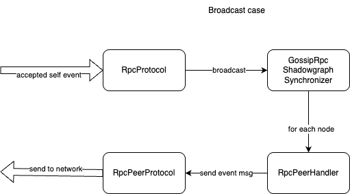

# Simple broadcast

As a proof-of-concept, a simple broadcast mechanism was implemented on top of rpc sync protocol.

It follows a very simple rule - each time a node creates an event, it pushes this event to all connected nodes.  There is no special handling for spanning trees, shunning nodes, etc - just very simple broadcast to all.

This works well only with a fully connected network, but this is what we have right now, and it gives a testing platform for more complex implementations and a baseline to compare them against.

The system is still using a full sync implementation as a fallback, but with a lower frequency, to allow catching up with broken nodes, work around dead connections, and provide some resiliency against malicious nodes.

To avoid a high duplicate ratio (where every sync resyncs all events coming from the broadcast anyway), the default frequency of sync was decreased to occur at most a few times per second. This provides a reasonable window for the broadcast to push enough events, which will be processed to reduce duplications. In the future, we might want to revisit more sophisticated sync algorithms, which will skip asking for items already received from the broadcast by not yet seen in the graph.

Biggest risk at this point is that there is no proper backpressure for broadcast. For sync, if receiving side is overloaded, it won't process sync fast enough, so next one will get delayed. It can ultimately lead to node falling behind, but in meantime, it will be responsive. With simple broadcast implementation above, nodes will continue to push events even given node is overloaded.

One of the possible solutions is rate limits agreed between the nodes, which can be used for both putting backpressure and for detecting/disconnecting spamming nodes.

## Diagram of new classes for RPC communication and broadcast interaction

