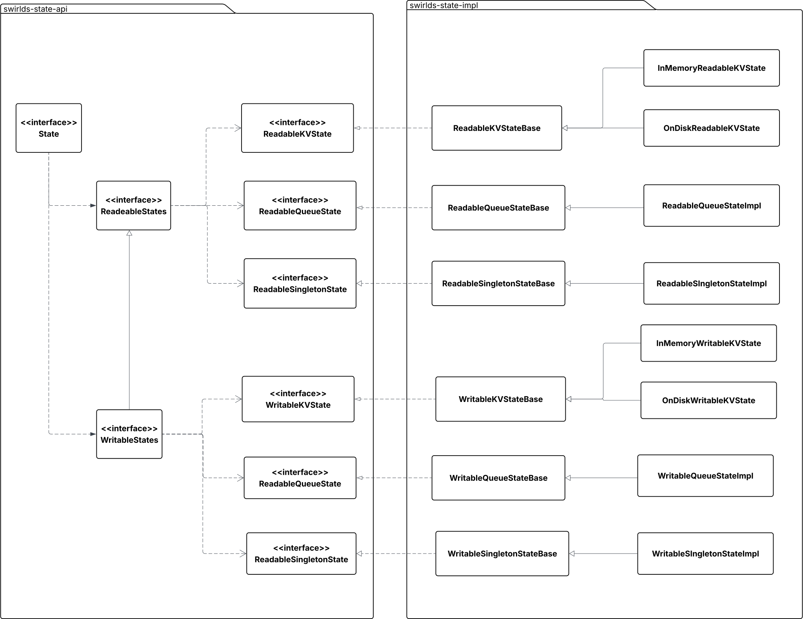
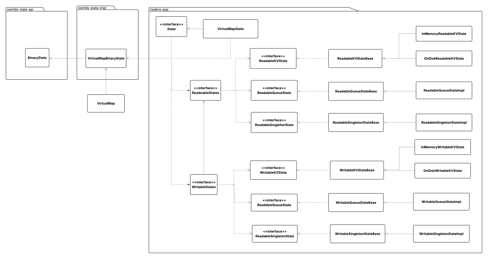

# Design Proposal: Introducing a Low-Level State API and Refactoring the Existing State API

---

## Summary

This proposal outlines the introduction of a new low-level State API and the refactoring of the current State API. The primary goal is to establish a clean separation between the State API and application logic, facilitating seamless integration with the Block Node.

## Purpose and Context

The current State API has several critical design flaws:

* It depends on the HAPI module, which impedes integration with the Block Node due to differences in protobuf protocol definitions.
* It includes interfaces and logic that are tightly coupled to the application layer but do not belong in the state management layer.

Previously, before the [typeless Virtual Map](https://github.com/hiero-ledger/hiero-consensus-node/issues/16785) implementation, we had to rely on service schemas to obtain codecs for key and value types. With that limitation removed, we now have the opportunity to introduce a clearer separation of concerns and eliminate unnecessary dependencies—such as the dependency on HAPI.

## Architecture

### Current class diagram



### Proposed class diagram



### Java classes

New `BinaryState` interface will be defined as follows:

```java
/**
 * Represents low-level State API to store singletons, key/value pairs, and queues by their ids.
 * Note that ids are defined by {@code VirtualMapKey} (see {@code virtual_map_state.proto}).
 * However, this module does not depend on the HAPI module directly, so the ids are just integers.
 * Service/state name to integer id mapping is defined in the {@code com.swirlds.state.BinaryStateUtils#stateIdFor} class.
 */
public interface BinaryState {
    /**
     * Puts serialized singleton value.
     *
     * @param id an id of the singleton type
     */
    void putSingleton(int id, Bytes value);

    /**
     * Puts a singleton value
     *
     * @param id    an id of the singleton type
     * @param codec a codec to convert the object into bytes
     * @param value value to put
     */
    <T> void putSingleton(int id, Codec<T> codec, T value);

    /**
     * Gets a serialized singleton value.
     *
     * @param id an id of the singleton type
     * @return The value, or null if there is no value.
     */
    Bytes getSingleton(int id);

    /**
     * Gets a singleton value.
     *
     * @param id an id of the singleton type
     * @param codec a codec to convert the bytes into an object
     * @return The value, or null if there is no value.
     */
    <T> T getSingleton(int id, Codec<T> codec);

    /**
     * Removes a singleton value by its id.
     *
     * @param id an id of the singleton type
     * @return removed value bytes
     */
    Bytes removeSingleton(int id);

    /**
     * Removes a singleton value by its id.
     *
     * @param id    an id of the singleton type
     * @param codec a codec to convert the bytes into an object
     * @return The removed value, or null if there was no value.
     */
    <T> T removeSingleton(int id, Codec<T> codec);

    /**
     * Adds a new value to the store, or updates an existing value.
     * Puts a key/value pair represented as {@code Bytes} objects
     *
     * @param id    an id of the key/value type
     * @param key   key bytes
     * @param value value bytes
     */
    void putKeyValuePair(int id, Bytes key, Bytes value);

    /**
     * Adds a new value to the store, or updates an existing value.
     *
     * @param id         an id of the key/value type
     * @param keyCodec   a codec to serialize the key object
     * @param key        key object
     * @param valueCodec a codec to serialize the value object
     * @param value      value object
     */
    <K, V> void putKeyValuePair(int id, Codec<K> keyCodec, K key, Codec<V> valueCodec, V value);

    /**
     * Removes a value by a key represented as {@code Bytes} object
     *
     * @param id  an id of the key/value type
     * @param key key bytes
     * @return removed value bytes
     */
    Bytes removeKeyValuePair(int id, Bytes key);

    /**
     * Removes the given key and its associated value from the map. Subsequent calls to {@link
     * #getValueByKey} will return {@code null}.
     *
     * @param id  an id of the key/value type
     * @param keyCodec key codec
     * @param key key object
     * @param valueCodec value codec
     * @return value object
     */
    <K, V> V removeKeyValuePair(int id, Codec<K> keyCodec, K key, Codec<V> valueCodec);

    /**
     * Gets the value associated with the given key represented as {@code Bytes} object. The
     * returned value will be null if the key does not exist in the state.
     *
     * @param id  an id of the key/value type
     * @param key key bytes
     * @return value bytes
     */
    Bytes getValueByKey(int id, Bytes key);

    /**
     * Gets the value associated with the given key. The
     * returned value will be null if the key does not exist in the state.
     *
     * @param id         an id of the key/value type
     * @param keyCodec   a codec to convert keys into bytes
     * @param key        key bytes
     * @param valueCodec a codec to convert value bytes into an object
     * @return value object
     */
    <K, V> V getValueByKey(int id, Codec<K> keyCodec, K key, Codec<V> valueCodec);

    /**
     * Adds a value represented as {@code Bytes} object to the queue
     *
     * @param id    id of the queue
     * @param value value bytes to add
     */
    void queueAdd(int id, Bytes value);

    /**
     * Retrieves and removes the element at the head of the queue,
     * or returns null if the queue is empty.
     *
     * @param id id of the queue
     * @return value retrieved value represented as {@code Bytes} object
     */
    Bytes queuePoll(int id);

    /**
     * Retrieves but does not remove the element at the head of the queue,
     * or returns null if the queue is empty.
     *
     * @param id of the queue
     * @return The element at the head of the queue, or null if the queue is empty.
     */
    Bytes queuePeek(int id);

    /**
     * Adds a value to the queue
     *
     * @param id    id of the queue
     * @param codec a codec to turn value bytes into an object
     * @param value value bytes to add
     */
    <T> void queueAdd(int id, Codec<T> codec, T value);

    /**
     * Retrieves and removes the element at the head of the queue,
     * or returns null if the queue is empty.
     *
     * @param id    id of the queue
     * @param codec a codec to turn value bytes into an object
     * @return value retrieved value represented as {@code Bytes} object
     */
    <T> T queuePoll(int id, Codec<T> codec);

    /**
     * Retrieves but does not remove the element at the head of the queue,
     * or returns null if the queue is empty.
     *
     * @param id    of the queue
     * @param codec a codec to turn value bytes into an object
     * @return The element at the head of the queue, or null if the queue is empty.
     */
    <T> T queuePeek(int id, Codec<T> codec);

    /**
     * Creates an iterator to traverse the elements of the queue with a given id.
     *
     * @param id  The id of the queue to iterate over.
     *
     * @return An iterator for the elements of the queue.
     */
    @NonNull
    <T> Iterator<T> createQueueIterator(int id, Codec<T> codec);

    /**
     * Returns a calculated hash of the state or calculates in a blocking manner
     *
     * @return calculated hash for the state
     */
    Hash getHash();

    /**
     * Answers the question if the state is already hashed.
     *
     * @return true if the state is already hashed, false otherwise.
     */
    boolean isHashed();

    /**
     * Get a copy of the object. The returned object type must be the same type as the original.
     * The original object becomes immutable after this call.
     *
     * @return a copy of the object
     */
    <T> T copy();

    /**
     * Called when this object is no longer needed.
     *
     * @return true if this call to release() caused the object to become destroyed
     */
    boolean release();

}
```

## Migration Strategy

The goal of this refactoring is to provide a clean, low-level interface for interacting with state.
The implementation of this interface should have minimal dependencies and **must not** depend on the HAPI module.

The existing `State` interface, along with its related interfaces and implementations, will be moved to the `hedera-app` module,
to `com.hedera.node.app.state` package.

However, to make this migration possible, we need to refactor the code in `swirlds-platform-core` that depends on the `State` interface and the related classes.

This code includes but not limited to:
- PlatformStateService, PlatformStateFacade, ReadablePlatformStateStore / WritablePlatformStateStore
- ReadableRosterStore / WritableRosterStore
- V0540PlatformStateSchema
- V0540RosterBaseSchema

The general strategy is to replace the usage of the `State` interface with the new `BinaryState` interface, or, in case of schemas,
come up with an alternative way initialization the roster singleton or the platform state.

After this refactoring, the State implementation will still be responsible for maintaining state change listeners and the registry of readable and writable states.
However, the responsibility for snapshot creation and hash calculation will be delegated to `BinaryState`.

## Testing

This refactoring doesn't add any new functionality.  All existing Hedera unit tests should pass with
the new binary state implementation. `BinaryState` should be covered by a set of unit tests.

## Performance impact

This refactoring introduces a thin abstraction layer between `VirtualMap` and `State` implementation. It should not have any
significant impact on performance.
