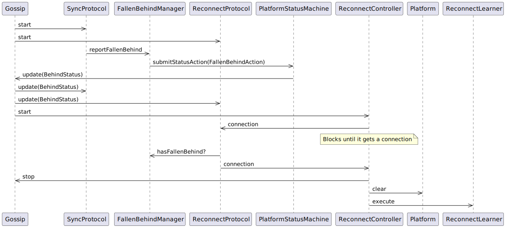
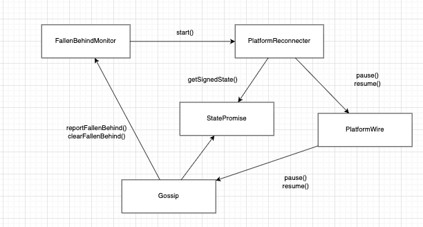
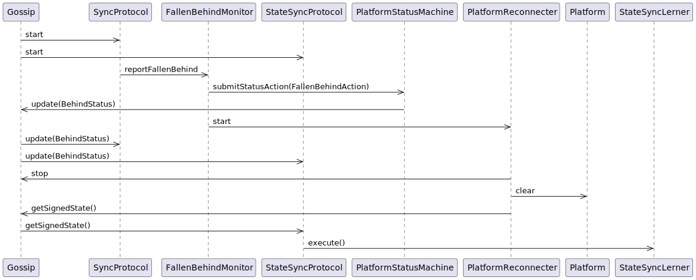
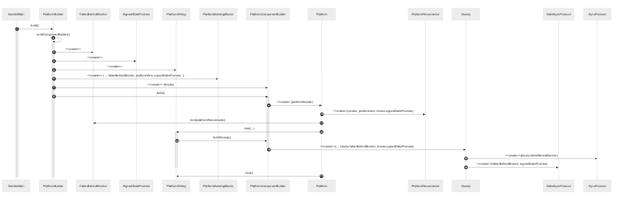

# Reconnect Refactor

## Motivation

This proposal covers a major refactoring of the platform's state synchronization and reconnect mechanism.

- "Gossip" component is tightly coupled to reconnect logic.
- We aim to have separated abstractions for network communication / gossip and reconnect logic in the future.
- Reconnect behavior (specifically the learning logic) is spread across multiple helpers with overlapping responsibilities (network, platform, sync helpers).
- Protocols couple directly to gossip-internal "fallen behind" management, blurring boundaries with platform status.

The goal is to make reconnect logic easier to maintain by moving it outside of gossip scope, and making it central in the platform.
We'll do this by consolidating orchestration in a single controller directed by a centralized monitor, make protocol decisions to rely on `PlatformStatus`
and remove the need of connections handoff.

## Current Approach (Before)

In a very simplistic explanation, the current reconnect logic is implemented in the following way:

Gossip component initiates protocols, which are running continuously, interleaved, and are executed only when certain conditions apply. Protocols owns the lifecycle of the connections to other peers.
SyncProtocol, which is one of our gossip implementations, compares the current hashgraph status against the peer's, and uses a mutable shared class (`FallenBehindManager`) to determine and keep track if the node has fallen behind.
If it detects that the node has fallen behind it will submit a FallenBehindAction to the platform status machine which in turn will update Gossip's internal state with the new status.
ReconnectProtocol contains part of the logic of syncing the state, the logic of the reconnect protocol is separated depending upon the node will act as a teacher or learner.
The different code paths are selected based on which of the node initiated the connection and using the `FallenBehindManager` to reject connections on some scenarios (For example, reject teaching when we are falling behind, or reject learning when we are teaching).
When acting as learner, the logic consist on sharing the connection using a blocking queue to an external class that will handle the reconnect logic.

When Gossip receives the BEHIND status change, it starts the `ReconnectController` logic in on a dedicated thread, which blocks until a connection can be acquired from the previously mentioned blocked queue.
When a connection is obtained, `ReconnectController` will stop all platform activity in preparation for gossip and using endless number of helper classes and method references to multiple pieces of the system, retrieves and validates the ReservedSignedState from the other peer.
If anything on the process goes wrong the code will retry until a configured maximum attempts threshold. If the operation succeeded, Gossip is resumed.

### Simplified interaction sequence:

> [!NOTE]
> Many classes have been removed in order to be able to show the interaction sequence.
> The number of classes in the class diagram and their relationship can hint how complex the real sequence is.

### Classes relationships and responsibilities:

* ReconnectController: The main control loop for retrying reconnects. Executes in an independent thread started by gossip.
* ReconnectStateLoader: Loading the received state into the platform.
* ReconnectPlatformHelper/ReconnectPlatformHelperImpl: Preparing the platform for reconnect (pausing gossip, clearing pipelines).
* ReconnectLearnerThrottle: Logic for throttling reconnect attempts and shutting down the node after too many failures.
* FallenBehindManager / FallenBehindManagerImpl: keeps the information about which nodes are behind. Can be queried.
* SyncManagerImpl: a wrapper around FallenBehindManager that adds metrics.
* ReconnectSyncHelper: Logic for obtaining a state via the network. ReconnectPeerProtocol provides this class with a connection using a shared blocking queue
* ReconnectLearner: Used by ReconnectController to perform the actual sync of the state.
* ReconnectLearnerFactory: creates instances of reconnectLearners. Used by ReconnectController
* ReconnectTeacher: Performs the sync of the state when acting as teachers. Is created and used by ReconnectPeerProtocol
* ReconnectUtils: Utility functions for handling the state

## Proposed Design (After)

### Constraints of the design

1. Gossip component will become our network layer whose responsibilities should be getting events from the network and getting a new state for reconnect.
2. Protocols cannot return a value to callers, they can share information outside their scope by associating them with consumers.
3. Obtaining a state from the network is an async blocking operation. We do not control when the "reconnection protocol" will execute and the caller will have to wait until the state is retrieved.
4. All the reconnect logic needs to be reworked when we connect to block nodes instead of consensus nodes.

### Changes

1. Introduction of `FallenBehindMonitor`:
   FallenBehindManager becomes a direct monitor and renamed accordingly.
   Classes like AbstractShadowgraphSynchronizer now use FallenBehindMonitor directly to report fallen-behind status.
   The class is not used to check if the node is behind anymore, that check is done through the platform status.
   It can be used to know if a certain node has reported that the local node has fallen behind.
   As soon as it detects the node is behind, it updates the platform status and starts the reconnect process invoking `PlatformReconnecter`
   This class will not be a component as doing so would remove the possibility that the learner logic can query it.

2. Introduction of PlatformReconnecter:
   PlatformReconnecter will be the central authority for handling the entire reconnect process. It will live outside the Gossip component and will be a first class citizen for the platform.
   Centralize the reconnect lifecycle: pause platform activity → wait to receive a state → validate → load → resume → retry with policy or error handling.
   It will directly coordinate platform action (for example, it calls gossip.pause(), clears wiring pipelines, and loads the new state via its own methods),
   through the `platformCoordinator` instead of using complex callbacks and atomic references passed through the PlatformBuilder.
   It absorbs the responsibilities of several to-be-deleted classes, making responsibility somehow less distributed among pieces

   * ReconnectController
   * ReconnectStateLoader
   * ReconnectPlatformHelper/ReconnectPlatformHelperImpl
   * ReconnectLearnerThrottle

   This makes PlatformBuilder / PlatformBuildingBlocks / Platform code simpler, lighter and easier to understand and the relationship between classes clear.
   This class can't be a component given that it will interact with other components (enabling and disabling them)

3. Refactoring Gossip:
   The gossip implementation (SyncGossipModular) and protocols will be simplified and decoupled from the reconnect orchestration.
   Its constructor will be much simpler. It no longer needs dependencies like swirldStateManager, statusActionSubmitter, or callbacks for loading state and clearing pipelines.
   It will work with the FallenBehindMonitor directly which will be shared with the protocols to be able to inform and query the status.

4. Introduction of `ReservedSignedStatePromise`: a piece of code based on our existing `BlockingResourceProvider`. It's an object with two use cases, one client manifests its desire to obtain a resource from the class, and it blocks until it gets the value,
   another client manifests its desire to provide a value, only one client at the time can provide a value, more than one are rejected. Given that the protocols cannot return a value to the outside world,
   PlatformReconnecter will use an instance of this class and signal the need to obtain a ReservedSignedState, the state sync protocol will ack that signal and provide with a reservedSignedState once obtained from the first peer that is deemed able to provide an useful state.

5. `ReconnectProtocol` Renaming:
   Given that the actual logic of a reconnect now happens outside the scope of gossip and the protocols, the new responsibility of the protocol becomes to retrieve a valid state from a peer.
   StateSyncProtocol better reflects this change of scope. It now operates when requested by `PlatformReconnecter` through the shared ReservedSignedStatePromise object.

6. `PlatformCoordinator` repurposing: This object currently only knows how to flush and clean the pipelines. IT will become the instance to hold all operations against the platform (e.g: start stop pause and resume gossip, submit a status action, push a roster update, etc. )

### Class diagram

### Interaction sequence diagram

### Creation sequence diagram

### Benefits

* Simplified Gossip component instantiation:  It no longer requires dependencies for loading state, submitting status actions, or clearing pipelines.
* Clear dependencies: moving away from indirect references (through lambdas, callbacks and atomic references) to direct object dependencies makes relationship between classes easier to follow.
* Simplify Lerner logic by removing helper classes and reorganizing code: Responsibility is not scattered all over, the steps of the process becomes more clear.
* Provide better refactor capabilities: This change enables the future plan of making the gossip component our network layer.

## Impact

- **JRS:** Tests that depends on finding logs will be affected as they will be modified/ shifted.
- **Junit Tests:** Mayor rewrite of over 50 tests.
- **Otter Tests:** Some capabilities depending on deleted pieces will have to be refactored.
- **Browser and Test applications:** All remaining testing application need to instance the new pieces.

## Future ideas

- Add phase timers and structured log fields (`phase`, `peerId`, `round`, `hash`, `attempt`, `durationMs`).
- Introduce a `ReconnectPolicy` for backoff, retries, and deadlines.
- Add a `reconnectId` correlation ID propagated across logs and over the wire for teacher/learner correlation.
