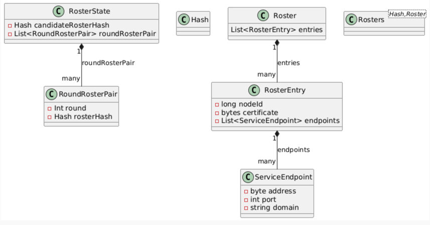
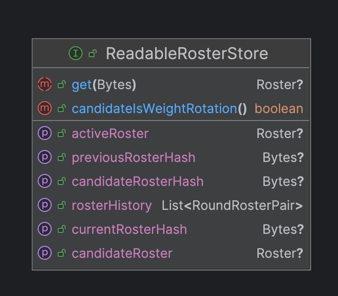
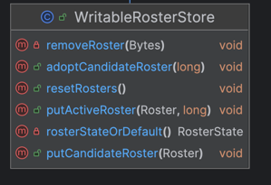
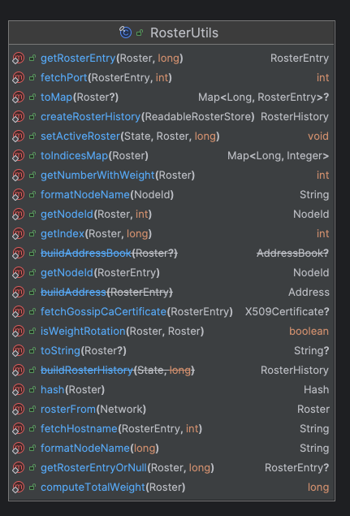
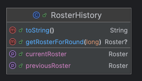
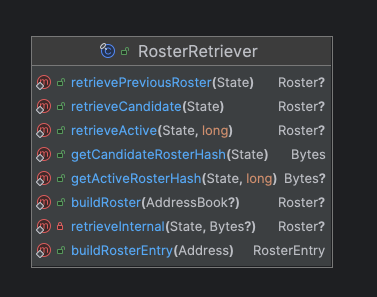
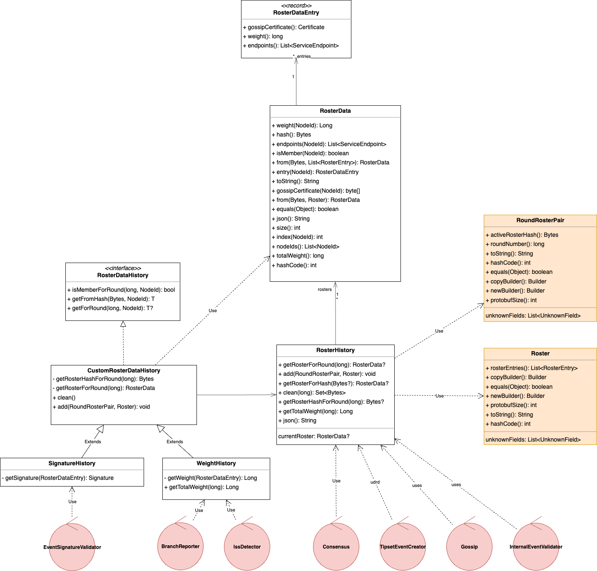
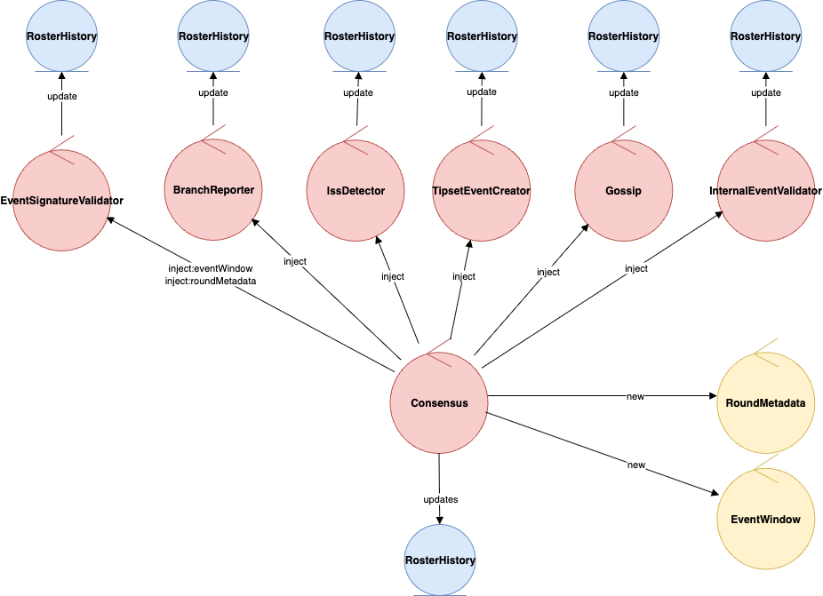

# Refactor of the `Roster` usage on the platform Code

## Motivation

* Too many abstractions and entry points with repeated operations
* Navigation Cost: Current implementation requires O(n) operations to retrieve a node information from a roster.
* Lacks support for more expressive or directly usable types (e.g., returning `Certificate` or `Address` instead of raw bytes).
* No memoization or internal caching to avoid repeated parsing or conversion costs.

## Description of the current code and how `Roster` is used

The platform's state contains two core components for handling rosters:

* "ROSTER_STATES": A singleton object.

* "ROSTERS": A key-value state (map-like structure).

### RosterStates (Singleton)

The RosterStates object is composed of:

* Candidate Roster Hash (currently unused).

* List of Round-to-Roster-Hash Pairs:

  * Behaves like a stack, always containing two elements during runtime:
    * The first (newest) element: Represents the active roster.

    * The second (older) element: Represents the previous roster.

### Rosters (Key-Value State)

The Rosters object is a map from a roster hash to a roster object.

Each `Roster` object is a pbj object containing:

* A list of RosterEntries. Each roster entry includes:
  * A node ID (long).
  * A certificate (as a byte[]).
  * A list of addresses, each consisting of:
    - An address (byte[] representing an ipv4 address).
    - A port (int).
    - A domain name (String).

### Diagram

### Accessing State – Readable and Writable Stores

* Readable Store: - Allows querying-
  * Active Roster
  * Previous Roster
  * Candidate Roster
  * History (list of round-to-roster-hash pairs)

* Writable Store: - supports -
  * Setting the Active Roster (thus setting the previous roster too and updating the history)
  * Setting the Candidate Roster

### Platform

The platform receives both `Roster` pbj objects and `RosterHistory` from the application in the start-up phase, or from the state
in the restart.
Consumes Roster via different utility classes:

* `RosterUtils`: A collection of static methods. Provides navigation of roster elements by node and updates the state.
  

* `RosterHistory`: A POJO. returns the roster applicable to a given round. also returns previous and active roster.

* `RosterRetriever`: Provides access to active, previous, and candidate rosters, also allows to modify the state. It's mostly used by services but is owned by platform.
  

### Where rosters are used in platform code

- ReconnectStateLoader: Converts a roster (current roster) to json and logs it
- SignedStateFileWriter: Converts a roster to json and writes it in a file, The roster used is read directly from the state
- IssMetrics: Requires iterating over the list of nodes in the roster. Requires each node's weight. Requires the roster total weight.
- DefaultEventSignatureValidator: Needs a Certificate from a round and Roster
- ReconnectStateLoader, ReconnectLearner, ReconnectLearnerFactory: use the current roster to send it to the DefaultSignedStateValidator
- DefaultSignedStateValidator: Requires each node's gossip certificate
- ConsensusRound/StreamedRound: holds the roster of that particular consensus round
  - used by UptimeTracker to iterates over all entries and adds their weight and the total weight of the roster to update metrics
  - used by ISSTestingToolConsensusStateEventHandler to iterates over all entries and adds their weight and the total weight of the roster
- SyncGossipModular: creates a PeerInfo object out of each RosterEntry. The used roster is the current roster.
- IssDetector: Requires the node's weight. Requires the roster's total weight. receives the current roster
- DefaultBranchReporter: Requires the node's weight. Requires iterating over the list of nodes in the roster. The used roster is the current roster.
- ConsensusImpl: Number of participants and each participant's weight. stronglySeeP uses an index instead of nodeId's to retrieve the participant's weight. The used roster is the current roster.
- Platform#getCurrentRoster() a method that is only used in tests and test applications and should be removed
  - SwirldsStateManagerTests: number of entries in the roster
  - WinTabAddresses: iterate over the roster entries, needs id, host, name, port.
  - SwirldsGui: number of entries in the roster
  - StressTestingToolMain: number of entries in the roster
  - StatsSigningTestingToolMain: number of entries in the roster
  - StatsDemoMain: number of entries in the roster
  - PlatformTestingToolMain: number of entries in the roster
  - PlatformTestingToolConsensusStateEventHandler: Heavily uses the roster to index transformation
  - MigrationTestingToolMain: number of entries in the roster.
  - CryptocurrencyDemoState: iterate over the entries in the roster, retrieve node id, number of entries in the roster.
  - TransactionGenerator: number of entries in the roster.

## Proposed changes

The following changes are described as a two stage effort. One part previous to DAB, and the second one once we decide to tackle that project.

### List of tasks previous to DAB

We need new abstractions built from `Roster` objects that provide better search capabilities.
We need to enable platform code to be able to use those new abstractions.

#### Create all new objects

##### Diagram

* `RosterData` class:
  Encapsulates roster information as an immutable data structure:
  Provides nodeIds(), weight(NodeId), getTotalWeight(), size(), index(NodeId), and lookup utilities.
  Implements equality, hashing, JSON serialization, and utility methods for integration.

* `RosterDataEntry`: Immutable record representing a single node's details like weight, gossip certificate, and endpoints.

* `RosterHistory`: Tracks the history of rosters across rounds and allows retrieval based on round numbers or hashes. A replacement for `org.hiero.consensus.roster.RosterHistory`.
  It will be mutable, it will return RosterData objects, it will allow components to maintain their own history and manage its updates, it will cache values.

* `SignatureHistory`: Specialized mutable data structure with custom transformation support and caching of `Signature` retrieved from a roster, a nodeId and a round number.

#### Change all uses of `Roster` to `RosterData`

Change all protobuf `Roster` usages to `RosterData`. After this task is completed platform should not use Roster protobuf object directly.

##### Affected pieces

* Components:
  * `org.hiero.consensus.event.creator.impl.tipset.TipsetEventCreator`
  * `com.swirlds.platform.ConsensusImpl`
  * `com.swirlds.platform.gossip.SyncGossipModular`
  * `com.swirlds.platform.event.validation.DefaultEventSignatureValidator`
  * `com.swirlds.platform.event.branching.DefaultBranchReporter`

> [!NOTE]
> ℹ️ after this change, `ConsensusImpl` will not require a node-to-roster-index map anymore and will be able to use the roterData index operation with the same O(1) complexity

* Platform support code:
  * `com.swirlds.platform.builder.PlatformBuilder`
  * `com.swirlds.platform.system.Platform`
  * `com.swirlds.platform.ReconnectStateLoader`
  * `com.swirlds.platform.state.address.RosterMetrics`
  * `com.swirlds.platform.recovery.internal.EventStreamRoundIterator`
  * `com.swirlds.platform.recovery.internal.StreamedRound`
  * `com.swirlds.platform.uptime.UptimeTracker`
* TipsetEventCreator support code:
  * `org.hiero.consensus.event.creator.impl.tipset.TipsetWeightCalculator`
  * `org.hiero.consensus.event.creator.impl.tipset.TipsetTracker`
  * `org.hiero.consensus.event.creator.impl.tipset.Tipset`
  * `org.hiero.consensus.event.creator.impl.tipset.TipsetMetrics`
* ConsensusImpl support code:
  * `com.swirlds.platform.consensus.ConsensusRounds`
  * `org.hiero.consensus.model.hashgraph.ConsensusRound`
  * `org.hiero.consensus.model.hashgraph.Round`
* SyncGossipModular support code
  * `com.swirlds.platform.Utilities`
  * `com.swirlds.platform.gossip.DefaultIntakeEventCounter`
* DefaultSignedStateValidator support code
  * `com.swirlds.platform.reconnect.DefaultSignedStateValidator`
  * `com.swirlds.platform.state.signed.SignedStateValidator`
  * `com.swirlds.platform.state.signed.SignedState`
  * `com.swirlds.platform.state.signed.SignedStateInfo`
  * `com.swirlds.platform.state.signed.SignedStateValidationData`
  * `com.swirlds.platform.metrics.IssMetrics`
* ReconnectStateLoader support code
  * `com.swirlds.platform.ReconnectStateLoader`
  * `com.swirlds.platform.reconnect.ReconnectLearnerFactory`
  * `com.swirlds.platform.reconnect.ReconnectLearner`

#### Change`RosterData` to `RosterHistory` as component's construction parameter

Components needing a `RosterData` will receive a `RosterHistory` instance instead.
The old RosterHistory object is removed from platformBuildingBlocks.

When using the rosterHistory to retrieve a `RosterData` object we can still use `getCurrentRoster` at this stage.

Note on this version of `RosterHistory`:

> [!NOTE]
> ℹ️ At this stage of the change RosterHistory is going to be immutable. The creation of RosterHistory will be performed once, and feed to each component needing it.
> The future idea is to make it a mutable class that can receive updates from input wires and have the ConsensusComponent provide the information that will be used to update the history.
> Each component will then need to use its own local copy of the RosterHistory and update it accordingly.

After this task, the old RosterHistory object will be deleted.

##### Affected pieces

* `com.swirlds.platform.event.branching.DefaultBranchReporter`
* `com.swirlds.platform.ConsensusImpl`
* `com.swirlds.platform.state.iss.DefaultIssDetector`
* `org.hiero.consensus.event.creator.impl.tipset.TipsetEventCreator`
* `com.swirlds.platform.gossip.SyncGossipModular`
* `com.swirlds.platform.reconnect.DefaultSignedStateValidator`

##### Removing from scope:

As Tipset objects store `roster` objects, is still unknown what should happen with old tips when we implement DAB, possibly they need to be recalculated, so there is no much benefit on changing these classes to use the roster history
* `org.hiero.consensus.event.creator.impl.tipset.TipsetWeightCalculator`
* `org.hiero.consensus.event.creator.impl.tipset.TipsetTracker`
* `org.hiero.consensus.event.creator.impl.tipset.Tipset`
* `org.hiero.consensus.event.creator.impl.tipset.TipsetMetrics`

#### `DefaultEventSignatureValidator` should use `SignatureDataMap`

- Use a data structure that allows to create and cache `Signature` instances in `DefaultEventSignatureValidator`.

#### List of tasks after DAB

The goal of this stage is to provide the possibility to all components to cache data they need to access from a roster for a particular round.
[See:](../consensus-layer/Consensus-Layer.md#roster-and-configuration-changes)

After DAB the relationship between the components will be as follows:

##### Make `RosterHistory` mutable and have every component receive its own local copy

`RosterHistory` will become mutable by adding the possibility to update (add new roster-round elements) and clean elements associated to expired rounds.
To avoid the need of making the object support concurrent modifications, each component will have their own `RosterHistory`.
`PlatformComponentBuilder` will receive a `RosterHistoryBuilder` initialized with the list of roundRoster pairs and the list of rosters.
At the moment of creation of each component, the `PlatformComponentBuilder` will use the `RosterHistoryBuilder` to create a new instance of the rosterHistory and provide it to the components.

##### retrieve `RosterData` form `RosterHistory` using `RosterHistory#getRosterForRound`

For DAB, all accesses to the RosterHistory needs to provide the round to get the applicable roster.

* `com.swirlds.platform.event.validation.DefaultEventSignatureValidator`: is already accessing using the history and the round, so no impact here.
* `com.swirlds.platform.event.branching.DefaultBranchReporter`: `#reportBranch` will use the event's birth round. `#updateEventWindow` will use the event's window latestConsensusRound. The constructor will still use getCurrentRoster.
* `com.swirlds.platform.ConsensusImpl`: In all places where consensus is using the roster we need to access the roster for the pending round.
* `org.hiero.consensus.event.creator.impl.tipset.TipsetEventCreator`: `#registerEvent` can use the event's birth round. TipsetEventCreator's constructor will still use  `rosterHistory.getCurrentRoster()` for the creation of tipsetTracker, tipsetMetrics, tipsetWeightCalculator. networkSize field can be removed and calculated dynamically using the event window.
* `com.swirlds.platform.state.iss.DefaultIssDetector`: `#handlePostconsensusSignature`:can access roster using the round in the signaturePayload; `#shiftRoundDataWindow` can access the roster using the roundNumber parameter.
* `com.swirlds.platform.gossip.SyncGossipModular` The constructor will still use  `rosterHistory.getCurrentRoster()` unless we can create the component sending the round as another parameter.

##### Create a hierarchy of `CustomRosterDataHistory`

We need to provide the possibility for all components to cache data they need to access from a roster for a particular round.
This logic will be repeated for different use cases in the platform code, so it's better to have it as centralized piece that can be reused.
We'll create a class hierarchy based on the previously added SignatureHistory

- Create a `CustomRosterDataHistory` with all the common logic for retrieving particular node's information on the roster for a round.
- create a `WeightHistory`: that allows to store individual weights and total weights.
- Use the `WeightHistory` in:
  - `IssDetector`
  - `BranchReporter`
  - `Consensus`
- It is possible that `SyncGossipModular` will need a similar  `PeerInfo` map, but at this stage its is not defined how gossip will react to the updates of the roster.

##### Consensus needs to inform all the other components about new rosters for future rounds

This will be done by adding new input wires connected from Consensus using the newly exposed round metadata
[See:](../consensus-layer/Consensus-Layer.md#roster-changes)

##### Components should update their local copy of the `RosterHistory`

The implementation of all wires receiving round metadata should be to update the local RosterHistory information.
The implementation of all wires receiving an event-window should be to remove all registered information in the RosterHistory associated to expired rounds.

##### Tipsets needs to be refreshed when a new RosterData applies to the current Round

Tipset objects store the roster internally, a change of roster renders all previously calculated tipsets void. They will need to be recalculated.

##### Gossip needs to update its internal state according to the roster for newer rounds

[See:](../consensus-layer/Consensus-Layer.md#roster-changes)
